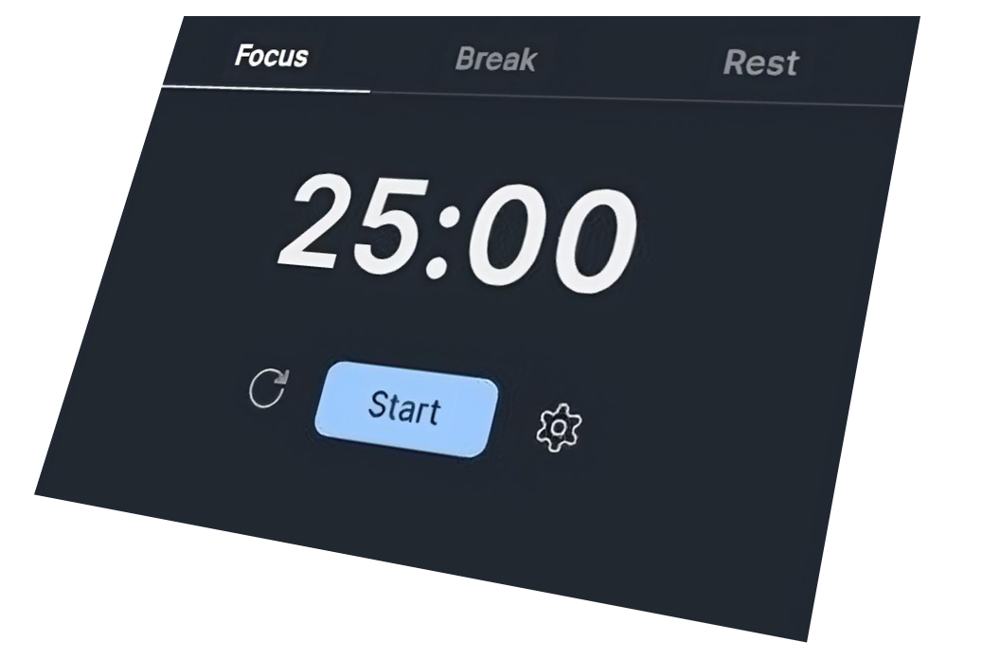
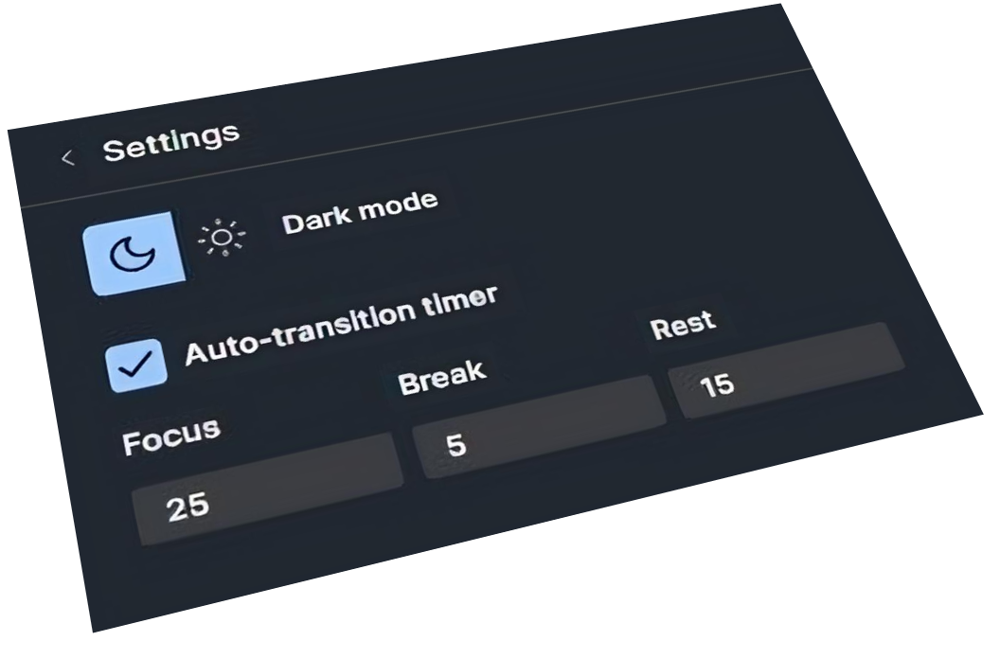

# Godoro

Godoro is a Pomodoro app built using GoLang and React, powered by the Wails framework.

## Table of Contents
- [Images](#images)
- [Installation](#installation)
- [Usage](#usage)
- [Features](#features)
- [Credits](#credits)

## Images

## Installation

To install Godoro, you can download the latest stable build from the releases section.

## Usage

Once installed, you can start using Godoro to manage your Pomodoro sessions:

1. Launch Godoro application.
2. Set the duration for your work and break sessions.
3. Start the timer to begin your Pomodoro session.

## Features

- Simple and intuitive interface.
- Customizable Pomodoro session durations.
- Pause and resume functionality for flexibility during work sessions.

## Credits

- Application Design by [Mai](https://www.figma.com/community/file/1339098747297145667/pomodoro-timer-with-settings-using-variables-fully-functional)
- Application Icon by [Kordás Barnabás](https://linktr.ee/kovaszos_uborka)
- Framework used [Wails](https://wails.io/)

## Contributing

If you'd like to contribute to Godoro, feel free to submit pull requests or open issues on our GitHub repository. We welcome any contributions or feedback to improve the app.

## License

This project is licensed under the [MIT License](./LICENSE).
